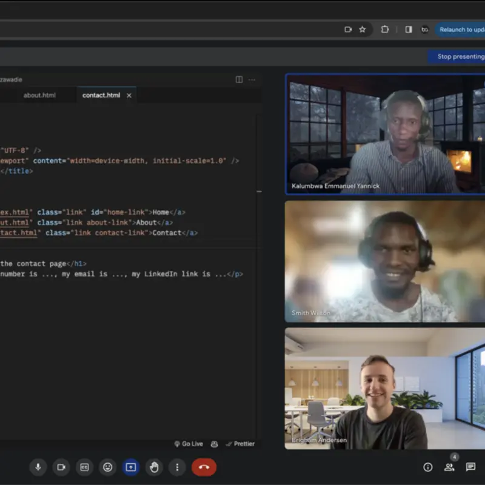

# tutorials

I love teaching, especially helping people learn to code. I’ve volunteered in many settings, from local elementary schools and online seminars to tutoring African Malawi refugees in HTML and CSS so they can build sustainable careers as web developers. I’ve also helped American college students master JavaScript and other core languages. There’s nothing more satisfying than seeing that light bulb go off when someone finally understands a challenging concept. You can find more on my GitHub, YouTube channel, and my portfolio site, brighamandersen.com.

