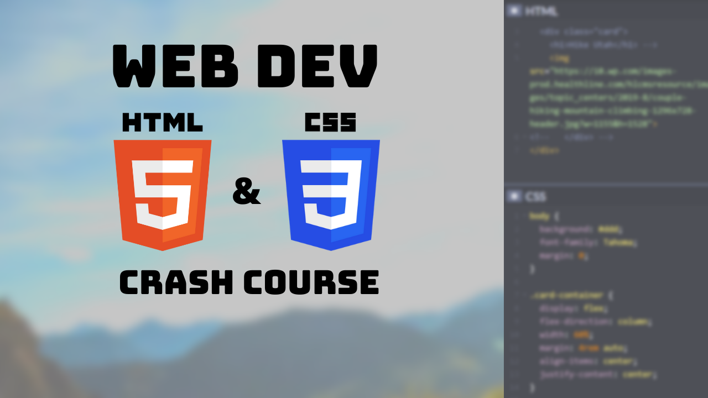

## Web Development Crash Course 1 - HTML & CSS



**Date: August 17, 2021**

[Watch on YouTube!](https://youtu.be/vGIRW00pB9w)

## Resources

- [HTML Live Demo CodePen](https://codepen.io/brighambandersen/pen/mdmQrwE)
- [HTML Practice Example CodePen](https://codepen.io/brighambandersen/pen/BaRRGzW)
- [CSS Live Demo CodePen](https://codepen.io/brighambandersen/pen/oNWQzWv)
- [CSS Practice Example CodePen](https://codepen.io/brighambandersen/pen/KKmmyLJ)

## Lesson Outline

Websites to showcase:

- [Simple Counter](https://brighambandersen.github.io/simple-counter)
- [Simple Calculator](https://brighambandersen.github.io/simple-calculator)
- [Weather Rain Or Shine](https://weather.brighambandersen.com)
- [NBA Insider Hub](https://bball.brighambandersen.com)
- [K9 Directory](https://brighambandersen.github.io/k9-directory)
- [Scoreboard](https://scoreboard.brighambandersen.com)
- [Jokester](https://jokester.brighambandersen.com)
- [Snake](https://snake.brighambandersen.com)
- [Piano](https://piano.brighambandersen.com)
- [Photography](https://photography.brighambandersen.com)
- [Portfolio](https://brighambandersen.com)

Web Development is for everyone! You have the flexibility to make websites about what you're passionate!

### Goal

Our goal is to make a basic website with login and information

Show [example site](https://codepen.io/brighambandersen/pen/KKmmyLJ)

First the basics of `HTML` and `CSS`

### HTML Basics

- HTML Boilerplate
- Change document `title`
- `h1`-`h6`
- `p`
- `a` (`<a href="https://www.google.com">Visit Google</a>`)
- `button`

`textarea`

`input`

- :number
- :date
- :time
- :color
- :password
- :range
- :label
- :checkbox
  ```
  <input type="checkbox"><label>Keep me logged in</label>
  ```
- :radio
  ```
  <input type="radio" id="male" name="gender" value="male">
  <label for="male">Male</label><br>
  <input type="radio" id="female" name="gender" value="female">
  <label for="female">Female</label><br>
  ```

`select` and `option` (dropdowns)

```
 <select name="cars">
   <option value="toyota">Toyota</option>
   <option value="honda">Honda</option>
   <option value="chevy">Chevy</option>
 </select>
```

- `div`
- `ul`, `ol`, `li`
- `table`, `tr`, `th`, `td`

  ```
  <table>
    <tr>
      <th>Company</th>
      <th>Contact</th>
      <th>Country</th>
    </tr>
    <tr>
      <td>Alfreds Futterkiste</td>
      <td>Maria Anders</td>
      <td>Germany</td>
    </tr>
    <tr>
      <td>Centro comercial Moctezuma</td>
      <td>Francisco Chang</td>
      <td>Mexico</td>
    </tr>
    <tr>
      <td>Ernst Handel</td>
      <td>Roland Mendel</td>
      <td>Austria</td>
    </tr>
    </tr>
  </table>
  ```

- `img`

### CSS Basics

Selectors (tag, class, id)

```
html, .class, #id {

}
```

Attributes

- `background-color`
- `color`
- `padding`
- `margin` (left, right, top, bottom, auto)
- `border` (1px solid black)
- `font-size`
- `font-weight` (bold)
- `font-style` (italic)
- `text-transform: uppercase`
- `text-decoration: underline`
- `text-align` (left, center, right)
- `flex`

### Making website

Dive right into making our website!

Either build off of [example site](https://codepen.io/brighambandersen/pen/KKmmyLJ), or if you're feeling daring, [make something original on CodePen](https://codepen.io/pen)!
